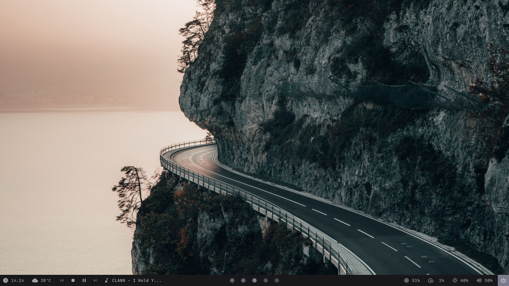
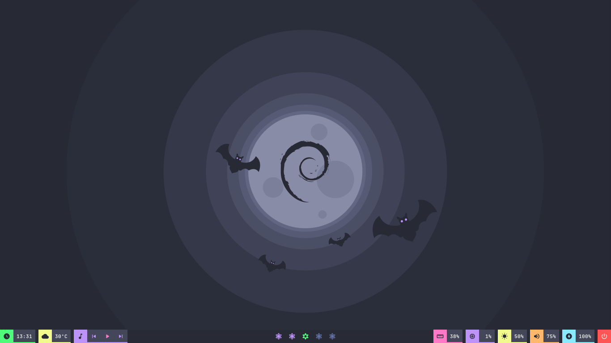
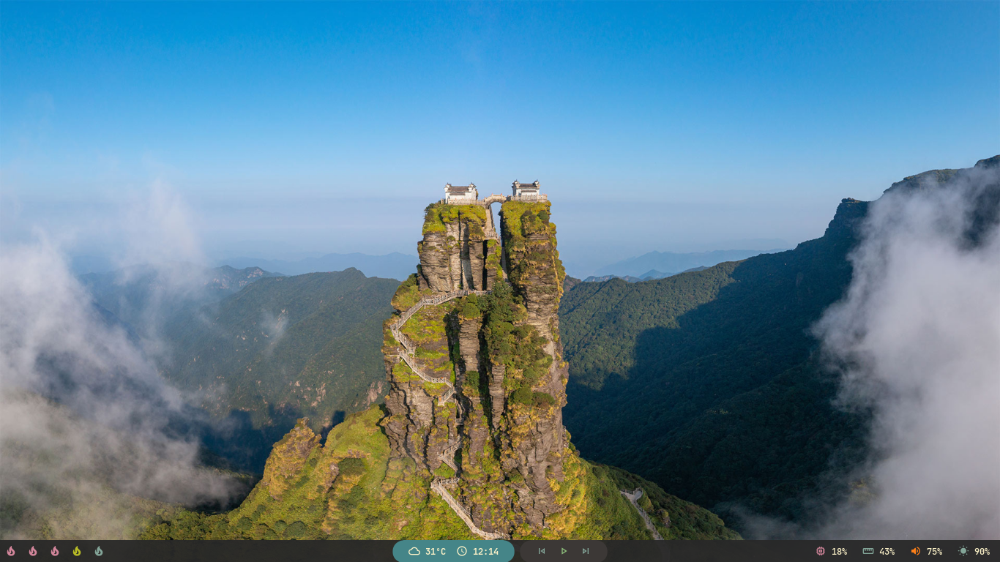
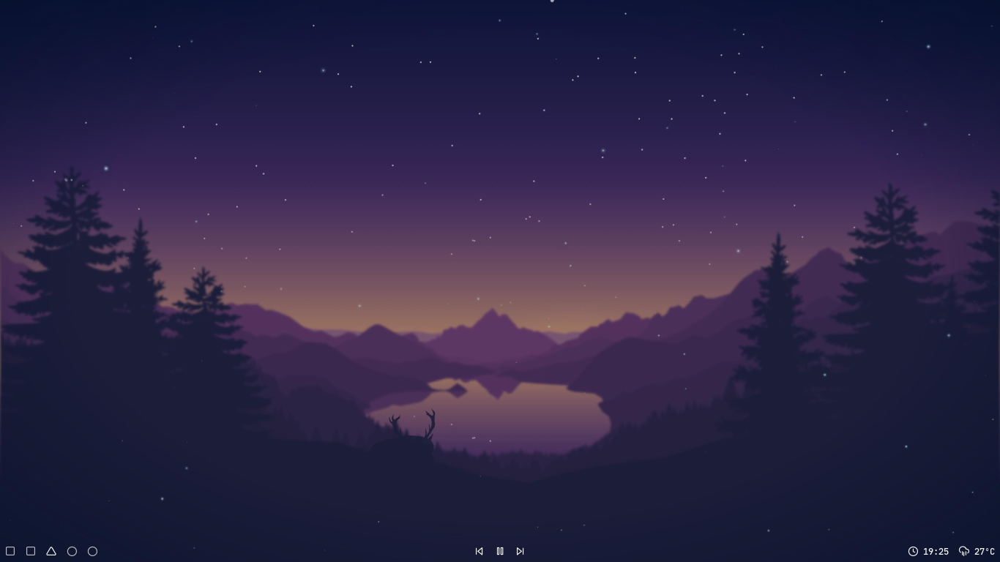
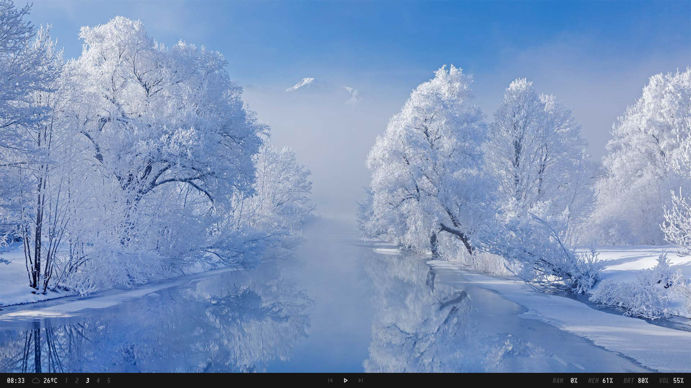
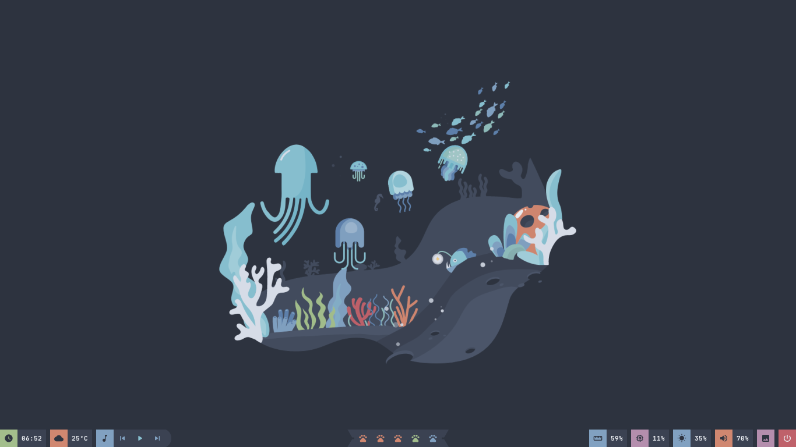
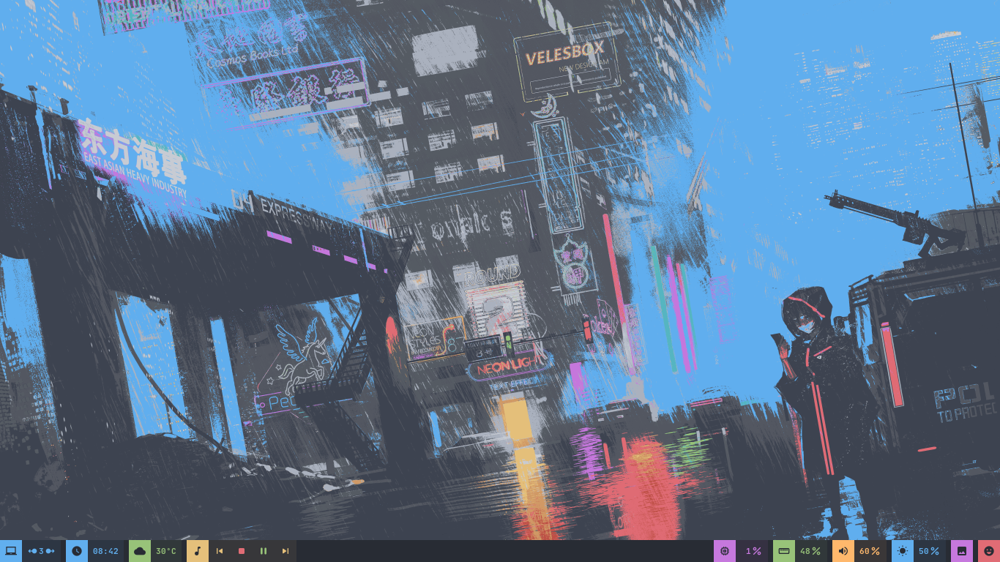

# Config Polybar

Adicionar diretório `polybar/` em `$HOME/.config`, caso nao seja adicionado a esse caminho, nao funcionara.  
Referencia = [adi1090x Polybar Collection](https://github.com/adi1090x/polybar-themes)

# Prerrequisitos

[Compiling Polybar](https://github.com/polybar/polybar/wiki/Compiling)
`JetBrainsMono` Instalar pelo [NerdFonts](https://www.nerdfonts.com/font-downloads):
[MaterialIcons](https://github.com/google/material-design-icons)
[Feather](https://feathericons.com/).

Comando para carregar fontes

```bash
$HOME
-> fc-cache -fv
```

# Running

Adicionar ao arquivo de configuração

## BSPWM

```bash
$HOME/polybar-collection/launch.sh
```

## I3wm

```bash
exec_always --no-startup-id $HOME/polybar-collection/launch.sh
```

# Alterando módulos

Para alterar os _modules_ basta mudar na arquivo `modules.ini` na raiz do diretório.

```ini
modules-left = date wallz nft tor weather bspwm i3
modules-center = mpd
modules-right = wired cpu memory xbacklight pulseaudio
```

## Weather app

As pointed out by Dennis Perrone, my personal OpenWeather API Key is in the project as a constant, and I did this intentionally so it just works, and it's fine if you want to use it the same as me, but I'll suggest you to create your own API Key for free in the official [OpenWeather](https://openweathermap.org/api) website. There's a limit of requests you can make using the same API Key, so we both could be without the weather info if a lot of requests are made.

After you create your API Key, you can pass as an argument in the **weather.sh** script, or you can set an environment variable for **OPENWEATHER_API_KEY** with your own API Key:

## Wallz

Still thinking about this one, maybe I should add more 'backend' options, for now is only using Bing API, but I could add more options since Bing API have a 'limited', but with a really good quality, wallpapers collection. For now I'll be only using on minimal theme, but when I'm 'done' I'll add to the others.

# Interessante...

- [Rofi Collection](https://github.com/Murzchnvok/rofi-collection)
- [Wallpaper Collection](https://drive.google.com/drive/folders/1o1qjRgkJtnF_8uGB1z6MRsQUjWinHUsw?usp=sharing)
- [Pomotroid (pomodoro app)](https://github.com/Splode/pomotroid)
- [Ugly To-Do](https://github.com/Murzchnvok/ugly-todo)

# Exemplos!

### Murz


```ini
modules-left = date weather round-right
modules-center = round-left bspwm round-right
modules-right = round-left mpd
```

### Chnvok



```ini
modules-left = date weather mpd
modules-center = bspwm
modules-right = memory cpu xbacklight pulseaudio session
```

### Dracula



```ini
modules-left = date margin weather margin mpd
modules-center = bspwm
modules-right = memory margin cpu margin xbacklight margin pulseaudio margin battery margin session
```

### Gruvbox



```ini
modules-left = bspwm
modules-center = round-left-blue weather date round-right-blue margin round-left mpd round-right
modules-right = cpu memory pulseaudio xbacklight
```

### Lofi



```ini
modules-left = bspwm
modules-center = mpd
modules-right = date weather
```

### Material


```ini
modules-left = weather margin date margin mpd tri-upper-right tri-lower-left bspwm tri-upper-right
modules-center =
modules-right = memory margin cpu margin xbacklight margin pulseaudio
```

### Minimal



```ini
modules-left = date weather bspwm
modules-center = mpd
modules-right = cpu memory xbacklight pulseaudio
```

### Nord



```ini
modules-left = date margin weather margin mpd round-right
modules-center = trap-left bspwm trap-right
modules-right = memory margin cpu margin xbacklight margin pulseaudio margin wallz margin session
```

### One Dark



```ini
modules-left = bspwm margin date margin weather margin mpd
modules-center =
modules-right = cpu margin memory margin pulseaudio margin xbacklight margin wallz margin session
```
